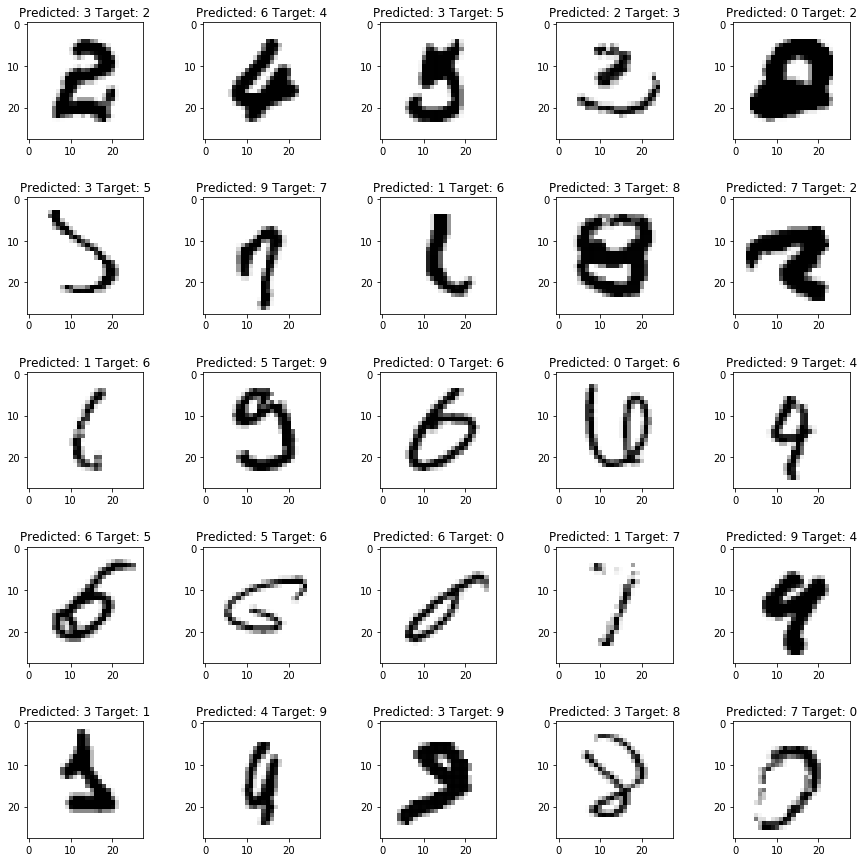
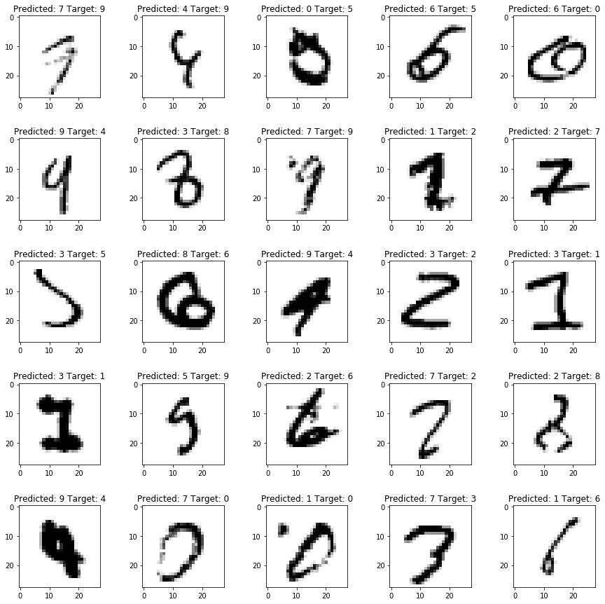
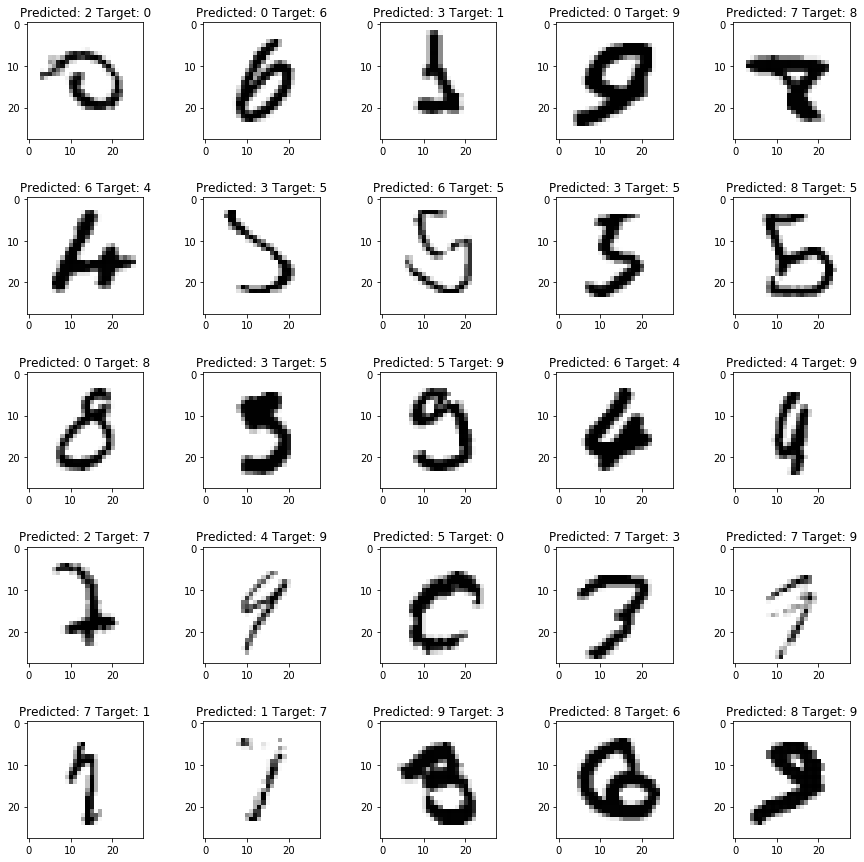
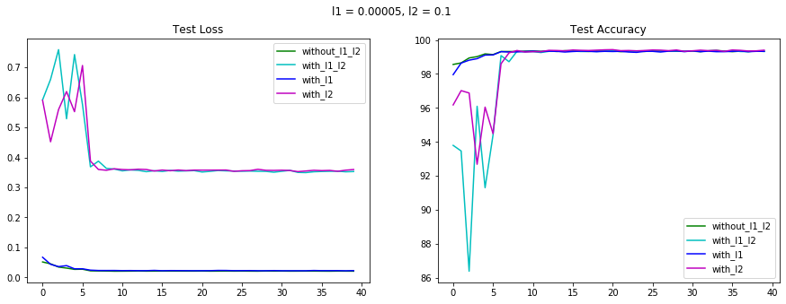
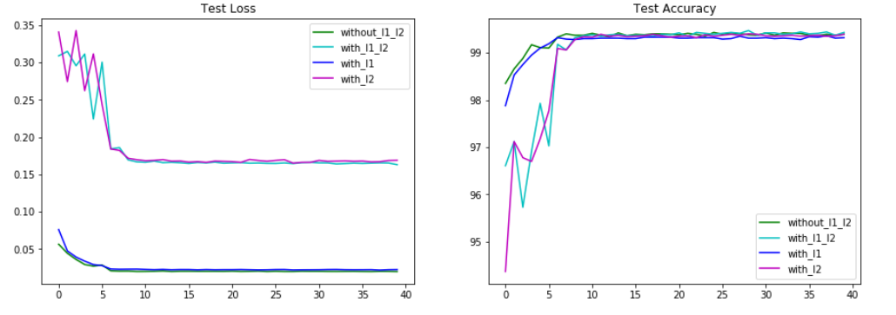
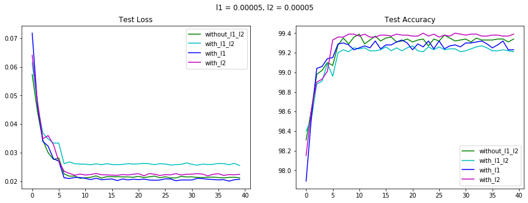

# Plot:

<a href="l1_0.0005 l2_0.0005.ipynb"><h1> L1 = 0.00005 L2 = 0.1<h1></a>

# Misclassified images:

# Without L1 and L2 regularization applied

# With L1 regularization applied

# With L2 regularization applied

# With L1 and L1 regularization applied

# Other plots:

<a href="l1_0.00005 l2_0.1.ipynb"><h1> L1 = 0.00005 L2 = 0.1<h1></a>

<a href="l1_0.00005 l2_0.05.ipynb"><h1> L1 = 0.00005 L2 = 0.05<h1></a>

<a href="l1_=_0_00005_l2_=_0_00005.ipynb"><h1> L1 = 0.00005 L2 = 0.0005<h1></a>

# Observations:

* Very high L2 value caused the loss to increase
* Reduction of gap between train and test accuracy is best achieved when both L1 and L2 are used.
* There is a decrease in train and test accuracy.
* The loss is least when L1 and L2 regularization are not applied.This maybe because the model was initially underfitting and regularization which is applied to reduce overfitting of the model, couldn't do much here
